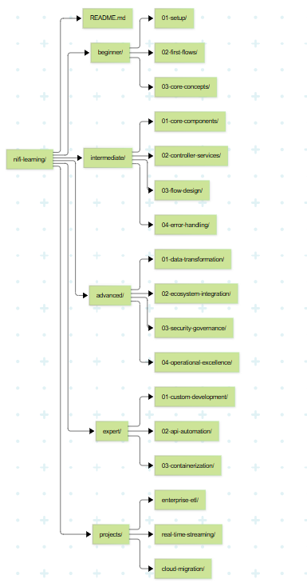

# 📘 Apache NiFi Learning Path

## Overview

This repository documents a **comprehensive learning path for Apache NiFi**, designed for Data Engineers. It covers learning from **beginner level setup to expert-level custom development**, including practical projects, integration with data ecosystems, and enterprise-scale optimization.

---

## 🎯 Learning Path

### **Beginner Level: Setup and Basics**

**Objective**: Get NiFi running and create your first data flows.

#### Installation and Setup

- Download and install Apache NiFi from [nifi.apache.org](https://nifi.apache.org)
- Configure basic settings in `nifi.properties`
- Setup SSL for secure access
- Familiarize yourself with Web UI: canvas, component toolbar, and operation palette

#### First Data Flows

- Create a simple flow: `GenerateFlowFile → PutFile`
- Understand **FlowFiles** and their attributes
- Practice **Expression Language** for basic transformations
- CSV file ingestion, processing, and transformation

#### Core Concepts

- Processors, Connections, Relationships
- Controller Services configuration
- Process Groups for modular flow organization
- Monitor flow performance and bulletins

---

### **Intermediate Level: Core Components Mastery**

**Objective**: Deep dive into processors and build complex flows.

#### Processor Categories

- **Input Processors**: `GetHTTP`, `ListenHTTP`, `GetFile`
- **Output Processors**: `PutSQL`, `PutKafka`, `PutS3Object`
- **Transformation Processors**: `JoltTransformJSON`, `QueryRecord`
- **Routing Processors**: `RouteOnAttribute`, `RouteOnContent`

#### Controller Services

- Database connection pooling (DBCPConnectionPool)
- SSL context services
- Avro schema registry
- HTTP context mapping

#### Flow Design Patterns

- Error handling strategies
- Data validation techniques
- Performance optimization
- Modular flow design with Process Groups

---

### **Advanced Level: Enterprise Implementation**

**Objective**: Build production-ready data flows with security and monitoring.

#### Data Transformation Mastery

- Advanced expression language techniques
- Record-oriented processing
- Complex data format handling (CSV, JSON, AVRO, XML)
- Schema evolution management

#### Ecosystem Integration

- Database systems integration (SQL & NoSQL)
- Streaming platforms: Kafka, Kinesis
- Cloud services: AWS, Azure, GCP
- Big data ecosystem: Hadoop, Spark

#### Security and Governance

- Authentication and authorization
- Data encryption and masking
- Compliance and auditing
- Data lineage and provenance tracking

#### Operational Excellence

- Cluster management and scaling
- Monitoring and alerting
- Version control and CI/CD pipelines (NiFi Registry)
- Disaster recovery planning

---

### **Expert Level: Custom Development and Optimization**

**Objective**: Extend NiFi capabilities and optimize for enterprise scale.

#### Custom Processor Development

- Java-based processor creation
- NAR packaging and deployment
- Testing and validation strategies

#### API Automation

- REST API for flow management
- Automated deployment pipelines
- Integration with external systems

#### Containerization and Orchestration

- Docker containerization
- Kubernetes deployment
- Helm charts for simplified management
- Auto-scaling strategies

---

## 🛠️ Practice Projects

### **Project 1: Enterprise ETL Pipeline**

- Extract from multiple sources (databases, APIs, files)
- Transform data with complex business logic
- Load to a data warehouse with error handling
- Implement data quality checks and monitoring

### **Project 2: Real-time Streaming Solution**

- Ingest from Kafka topics with multiple consumers
- Enrich streams with reference data
- Perform windowed aggregations
- Route data to multiple destinations based on content

### **Project 3: Cloud Migration Pipeline**

- Migrate on-premise data to cloud storage
- Implement hybrid cloud data flows
- Optimize for cost and performance
- Ensure data consistency and validation

---

## 📚 Learning Resources

### Official Documentation

- [Apache NiFi Documentation](https://nifi.apache.org/docs.html)
- [NiFi GitHub Repository](https://github.com/apache/nifi)
- [NiFi REST API Documentation](https://nifi.apache.org/docs/nifi-docs/rest-api/)

### Recommended Courses

- "Apache NiFi for Data Engineers" (Udemy)
- "Data Engineering with Apache NiFi" (Coursera)
- "Real-time Data Processing with NiFi" (Pluralsight)

### Books

- "Apache NiFi: A Complete Guide" by Christian Posta
- "Data Flow with Apache NiFi" by Joe Witt
- "Mastering Apache NiFi" (examples-based)

### Community Resources

- Apache NiFi mailing lists
- Stack Overflow (#apache-nifi)
- NiFi Slack community channels
- GitHub issues and discussions

---

## 🛠️ Practice Environment Setup

### Local Development

- Single-node NiFi installation
- Docker-based development environment
- Sample datasets for practice

### Cloud Sandboxes

- **AWS**: Free tier with S3, RDS, Kinesis
- **Azure**: Free account with Blob Storage, Event Hubs
- **GCP**: Free tier with BigQuery, Pub/Sub

### Containerized Environment

- Docker Compose with NiFi, databases, Kafka
- Kubernetes cluster for advanced deployment
- Helm charts for easy deployment

---

## ✅ Repository Structure (Practical)

